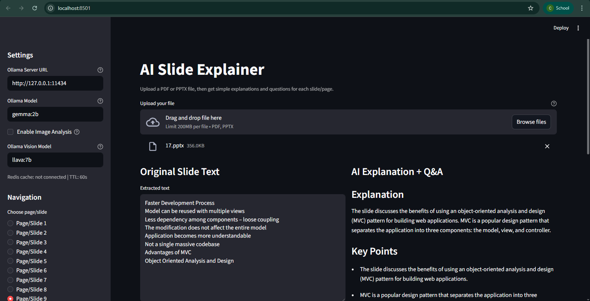
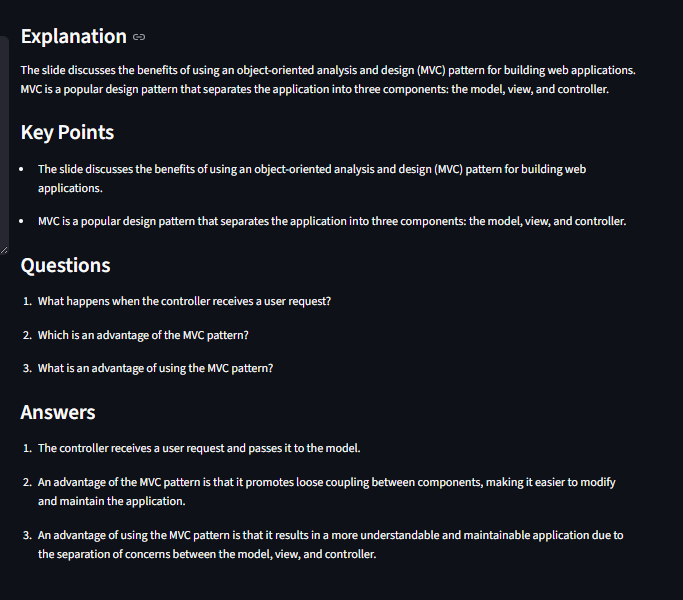
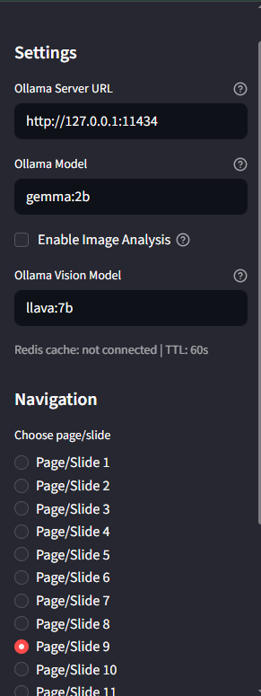

# AI Slide Explainer

AI Slide Explainer is a Streamlit app that helps students understand PPTX and PDF content quickly.

You can upload a file, open any page or slide, and get:
- Simple explanation
- Important questions
- Answers
- Optional quiz (MCQs)
- Optional image-aware insights using an Ollama vision model

## Key Features

- Upload PDF and PPTX files
- Sidebar navigation for page/slide selection
- Extracted text view
- AI Explanation + Q and A
- Optional 5-question quiz generation
- Optional image analysis (vision model)
- Slide/page preview in UI
- Caching with:
  - Streamlit session cache
  - Redis cache with TTL auto-expiry

## Tech Stack

- Python
- Streamlit
- PyMuPDF
- python-pptx
- Ollama (local LLM)
- Redis (optional, for persistent cache with expiry)

## Project Structure

- main.py: Streamlit UI, navigation, orchestration
- document_parser.py: PDF/PPTX parsing, image extraction, preview extraction
- ai_engine.py: Ollama text + vision integration, prompting and parsing
- retrieval_engine.py: chunking, simple embeddings, retrieval
- redis_cache.py: Redis get/set/touch helpers
- requirements.txt: Python dependencies
- ui/: UI screenshots

## Prerequisites

1. Python 3.10+
2. Ollama installed and running
3. At least one text model (example: gemma:2b)
4. Optional vision model for image understanding (example: llava:7b or moondream)
5. Optional Redis server running for persistent cache

## Installation

1. Open terminal in project folder.
2. Install dependencies:

```powershell
pip install -r requirements.txt
```

3. Pull required Ollama models (examples):

```powershell
ollama pull gemma:2b
ollama pull llava:7b
```

If llava:7b is too heavy for your machine, use a smaller vision model:

```powershell
ollama pull moondream
```

## Run the App

```powershell
streamlit run main.py
```

## Optional Environment Variables

### Ollama

- OLLAMA_BASE_URL (default: http://127.0.0.1:11434)
- OLLAMA_MODEL (default: gemma:2b)
- OLLAMA_VISION_MODEL (default: llava:7b)
- OLLAMA_MODELS (optional custom model directory)

### Redis

- REDIS_ENABLED (default: 1)
- REDIS_URL (default: redis://127.0.0.1:6379/0)
- REDIS_CACHE_TTL_SECONDS (default: 300)

## Redis Expiry Behavior

The app uses session-scoped Redis keys and TTL.

- Generated content is cached for faster revisit.
- Keys auto-expire when TTL passes without refresh.
- This gives near-automatic cleanup after app/session inactivity.

## Notes on Image Analysis

- Text extraction works for normal slide/page text.
- True image understanding requires a vision model.
- If vision model loading fails due to memory, the app continues with text-only flow.
- Use a smaller vision model if you see memory errors.

## UI Screenshots






## Troubleshooting

1. Ollama connection issue:
- Verify Ollama is running
- Verify OLLAMA_BASE_URL

2. Vision model memory error:
- Switch to smaller vision model (example: moondream)
- Keep image analysis enabled only when needed

3. Redis not connected:
- App still works using Streamlit in-memory cache
- Check REDIS_URL and Redis server status

## Future Improvements

- OCR fallback for image text
- Better slide rendering for PPTX full preview
- Export summary/quiz as file
- Multi-user session management
